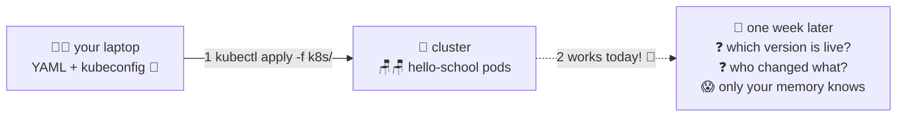

# 🎒 Lesson 01 — Deploy by hand: you ARE the deploy system

**📍 You are here:** Lesson **01** of 12 · Next: `lesson-02-drift-problem`

---

## 📦 What's in this branch

The starting point of the whole course: deploying the demo app **the way everyone
starts** — by hand, with kubectl, from your laptop. It works! And by the end of
this lesson you'll see exactly why it can't stay this way. Real files:

- [k8s/](../../k8s/) — the demo app: namespace + deployment (2 pods) + service

## 🧒 Explain like I'm 5

You have homework to hand in. So you **carry it to school yourself** 🎒 — walk
in, put it on the teacher's desk, done. Perfectly fine!

Now imagine doing that for **every subject, every day, for the whole class**,
because somehow *you* became the homework-delivery kid:

- You're sick? 🤒 Nothing gets delivered.
- You forget one notebook? Nobody notices until the teacher shouts.
- Your friend also delivers some homework, differently? Now two people's
  memories disagree about what was handed in.
- Teacher asks *"when was this handed in, and by whom?"* — your answer is
  a shrug. 🤷

Hand-delivery isn't wrong — it's how you *learn the route*. But the route
must eventually run **without you**.

## 🗺️ Diagram



## ❓ What

- `kubectl apply -f` sends your local YAML to the cluster's API server —
  a **manual, push-style** deploy where the "pipeline" is your fingers.
- The deploy "record" is your shell history. The rollback plan is your memory.
- This is 100% fine for **learning and experiments** — and how everyone should
  start, so the automation later isn't magic.

## 🤔 Why (this lesson exists)

You can't appreciate ArgoCD by starting with ArgoCD — you'd just be following
ceremony. This course makes you **feel each problem before meeting its fix**:
lesson 02 shows the silent killer (drift), lesson 03 automates the delivery,
lesson 04 shows what's *still* broken, and Part 2 fixes it properly.

## 🔧 How (in this repo)

The demo app is deliberately tiny — one Deployment running
`nginxdemos/hello:plain-text` (it answers with its pod name, so you can SEE
which pod replied), one Service, one namespace. No placeholders — everything
in [k8s/](../../k8s/) applies as-is on any local cluster.

## 🧪 Try it

```bash
# any local cluster: Docker Desktop's Kubernetes, minikube start, or kind
kubectl apply -f k8s/
kubectl -n gitops-school get pods          # 2 pods

# see WHICH pod answers (run it a few times — the name changes!):
kubectl -n gitops-school run t --rm -it --image=curlimages/curl --restart=Never \
  -- curl -s http://hello-school

# now the uncomfortable questions:
kubectl -n gitops-school get deploy hello-school -o jsonpath='{.spec.template.spec.containers[0].image}'
# ...is that what YOU think is deployed? what would your teammate say?
history | grep "kubectl apply" | tail -3   # ← this is your entire audit trail 😬
```

## ⏭️ Next

Leave the app running — lesson 02 is going to vandalize it a little, to show
you the silent killer of hand-run clusters: **drift**.

```bash
git checkout lesson-02-drift-problem
```
