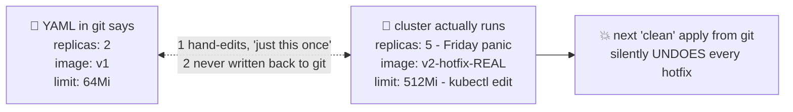

# 🪑 Lesson 02 — Drift: when reality stops matching the files

**📍 You are here:** Lesson **02** of 12 · Previous: `lesson-01-deploy-by-hand` · Next: `lesson-03-cicd-push`

---

## 📦 What's in this branch

Lesson 01, **plus** the villain of this whole course: **configuration drift** —
the growing gap between what your YAML says and what the cluster actually runs.
Every fix in Part 2 exists because of this lesson.

## 🧒 Explain like I'm 5

The classroom has a **seating chart** taped in the teacher's drawer 🗂️ — who
sits where, 2 plant-waterers, projector on the left.

But day by day, little things happen *without updating the chart*:

- Friday panic: "exam results night, add 3 more helpers!" — done by shouting,
  not by editing the chart. 🗣️
- A projector breaks; someone drags in the one from Room 3B. Nobody writes
  it down.
- A substitute teacher rearranges the front row "just for today". It stays.

Three months later the chart says one thing, the room is **completely
different**, and here's the scary part: 😱

> The next time someone innocently "resets the room to the chart", they
> **destroy every unrecorded fix at once** — and nobody remembers why the
> extra projector mattered.

That gap between chart and room is **drift**. It's not one big mistake — it's
a hundred tiny "just this once" edits that never got written down.

## 🗺️ Diagram



## ❓ What

- **Drift** = actual cluster state ≠ declared state in your files, caused by
  `kubectl edit`, `kubectl scale`, `kubectl patch`, dashboard clicks, hotfixes.
- Drift is invisible by default: **nothing in a bare cluster tells you** the
  live Deployment no longer matches the repo. `kubectl diff` exists, but only
  helps the person who remembers to run it.
- Worst-case failure isn't the drift itself — it's the **innocent re-apply**
  that wipes undocumented fixes, usually during an incident, at night. 🌙

## 🤔 Why it matters

Drift is why "it worked in staging" lies, why disaster recovery fails ("just
re-apply the repo!" — the repo was 3 months stale), and why new teammates
can't trust anything written down. Remember this feeling — in lesson 09,
ArgoCD will detect this exact situation in **seconds** and revert it.

## 🔧 How (see it in this repo)

The demo Deployment declares `replicas: 2` in
[k8s/deployment.yaml](../../k8s/deployment.yaml). You're about to make the
live cluster disagree with that file — congratulations, you'll have
manufactured genuine drift in 10 seconds.

## 🧪 Try it

```bash
# the file says replicas: 2 — now vandalize reality:
kubectl -n gitops-school scale deployment hello-school --replicas=5
kubectl -n gitops-school edit deployment hello-school   # change something small, e.g. add a label

# your repo and your cluster now disagree. Would you have noticed?
kubectl diff -f k8s/ | head -30        # ← the honest mirror (run it BEFORE any apply!)

# the horror-movie moment — an innocent teammate "deploys the repo":
kubectl apply -f k8s/
kubectl -n gitops-school get deploy    # replicas back to 2 — your hotfix is GONE, silently
```

## ⏭️ Next

First fix: stop humans from deploying at all. Enter the **courier robot** —
a CI/CD pipeline.

```bash
git checkout lesson-03-cicd-push
```
