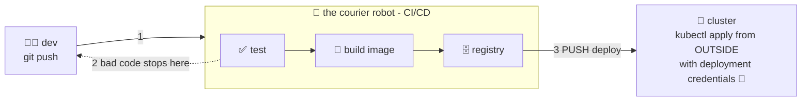

# 📮 Lesson 03 — CI/CD push: the courier robot deploys for you

**📍 You are here:** Lesson **03** of 12 · Previous: `lesson-02-drift-problem` · Next: `lesson-04-limits-of-push`

---

## 📦 What's in this branch

Lessons 01–02, **plus** the first real fix: a **CI/CD pipeline** that tests,
builds and deploys on every push — the **push model**, where an outside system
shoves changes into the cluster.

## 🧒 Explain like I'm 5

The school got tired of kids hand-delivering homework, so it hired a
**courier robot** 📮. Now you just drop your homework in the mailbox
(`git push`) and the robot does the same steps, every single time:

1. **Checks it** ✅ — spelling and math (runs the tests). Bad homework never
   leaves the mailroom.
2. **Photocopies it** 🍱 — the official copy (builds the container image).
3. **Files the copy** 🗄️ — into the cabinet (pushes to the registry).
4. **Delivers it** 🚚 — drives to school, unlocks the door with the **deployment credentials it carries** 🔑 (a stored kubeconfig at worst, a short-lived OIDC badge at best), and puts everything in place (`kubectl apply`).

Huge upgrade! No more forgotten steps, no more "works on my machine", and
there's a delivery log in the mailroom. But keep an eye on those credentials — and on what happens *after* the robot drives away… (lesson 04 😈)

## 🗺️ Diagram



## ❓ What

- **CI** (Continuous Integration): every push is automatically tested & built.
- **CD** (Continuous Delivery/Deployment): the built artifact is automatically
  released. Together: nobody deploys by hand anymore.
- **Push model**: the pipeline needs **deployment credentials** to reach the cluster from outside — a kubeconfig stored as a CI secret in the simplest setups, or short-lived credentials obtained via OIDC (the [Docker school's lesson 12](https://github.com/BaluRaut/learn-docker-school/blob/lesson-12-ci-to-cloud/lessons/12-ci-to-cloud/README.md) shows the OIDC pattern for ECR; the same idea works for EKS). Either way, an outside system pushes changes in.
- This is exactly what the
  [Kubernetes course's CircleCI pipeline](https://github.com/BaluRaut/learn-kubernetes-school/blob/main/.circleci/config.yml)
  does: test → build → push to ECR → manual approval → `kubectl apply`.

## 🤔 Why

The pipeline fixes the *human* problems from lesson 01: forgotten steps,
skipped tests, single-person knowledge, no delivery record. Every deploy is
now traceable to a commit and repeatable. This alone is a massive, genuine
upgrade — most teams should get here before even thinking about ArgoCD.

## 🔧 How (a minimal example)

A push-style deploy job in GitHub Actions looks like this (illustrative —
don't commit real cluster credentials, use CI secrets):

```yaml
# .github/workflows/deploy.yml (example — the k8s course uses CircleCI, same idea)
on:
  push:
    branches: [main]
jobs:
  deploy:
    runs-on: ubuntu-latest
    steps:
      - uses: actions/checkout@v4
      - run: echo "$KUBECONFIG_DATA" | base64 -d > kubeconfig   # 🔑 deployment credentials — here a stored kubeconfig; see the OIDC note
        env: { KUBECONFIG_DATA: ${{ secrets.KUBECONFIG_DATA }} }
      - run: KUBECONFIG=kubeconfig kubectl apply -f k8s/        # push it in
      - run: KUBECONFIG=kubeconfig kubectl -n gitops-school rollout status deploy/hello-school
```

Note what just happened: **the cluster's key now lives outside the cluster**,
in the CI system's secret store. Remember that.

> 🪪 **Stored key vs OIDC.** This example stores a kubeconfig as a CI secret — the simplest and least safe shape. The better shape is what the Docker school's lesson 12 does for ECR: the job proves who it is via **OIDC** and receives a **short-lived** credential (for EKS: `aws eks update-kubeconfig` after `role-to-assume`). No long-lived key sits in CI — but the pipeline still needs *some* way in from outside, and lesson 04 is about what that means.

## 🧪 Try it (simulate the robot locally)

```bash
# play courier robot yourself — the exact steps a pipeline runs:
kubectl diff -f k8s/ || true                          # 1. what would change?
kubectl apply -f k8s/                                 # 2. deliver
kubectl -n gitops-school rollout status deploy/hello-school   # 3. confirm it landed

# the pipeline's superpower is that it NEVER does it differently.
# your superpower is that you now know each step it automates.
```

## ✅ Verify — what you should see

Simulating the robot locally, the last command — `kubectl -n gitops-school rollout status deploy/hello-school` — prints `successfully rolled out`. In a real pipeline: a green job, and `kubectl -n gitops-school get deploy hello-school -o jsonpath='{.spec.template.spec.containers[0].image}'` shows exactly the tag that job built.

## 🧹 Clean up

Nothing was installed. If you created a real workflow on a fork, delete the stored kubeconfig secret when you are done — it is a credential to your cluster, even a local one.

## ⚠️ Common mistakes

- pasting a cluster-admin kubeconfig into CI secrets and calling it done — scope it, or better, obtain short-lived credentials via OIDC ([Docker school L12](https://github.com/BaluRaut/learn-docker-school/blob/lesson-12-ci-to-cloud/lessons/12-ci-to-cloud/README.md))
- letting the deploy step run even when tests fail (job ordering / `needs:`)
- deploying `:latest` — the pipeline can no longer tell you what actually shipped

> 🏭 **Why this matters in production:** push pipelines are the majority of real deployments and a genuine upgrade over hand deploys. Do them well — short-lived credentials, tag = commit SHA, `rollout status` as the gate — before reaching for ArgoCD. GitOps adds a reconcile loop; it does not replace CI.

## ⏭️ Next

The courier is great — so why does Part 2 of this course exist? Because of
what the courier **can't** do. Lesson 04 counts the gaps.

```bash
git checkout lesson-04-limits-of-push
```
