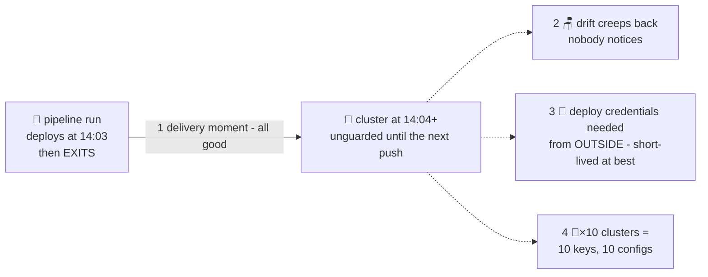

# 🚪 Lesson 04 — Limits of push: the courier delivers… and LEAVES

**📍 You are here:** Lesson **04** of 12 — end of Part 1 · Previous: `lesson-03-cicd-push` · Next: `lesson-05-gitops-idea`

---

## 📦 What's in this branch

Lessons 01–03, **plus** the honest audit of the push model — the four gaps
that no amount of better pipeline fixes. This is the door into Part 2.

## 🧒 Explain like I'm 5

The courier robot 📮 is genuinely great. But watch what happens at **14:04**,
one minute after it delivered and drove away:

1. **Nobody is watching the room.** 🪑 A kid rearranges the chairs at 15:00
   (drift, lesson 02!). The courier? Already gone. It only comes back when
   someone mails new homework — maybe next Tuesday. The mess sits there
   unnoticed for days.
2. **The courier needs a way in from outside.** 🔑 To deliver, the courier
   must obtain deployment credentials — a copied key kept in its van at
   worst (a kubeconfig stored in CI), a short-lived badge at best (OIDC, as
   in the Docker school's lesson 12). Short-lived is much better — but a
   door that opens from the street still has to exist, be scoped, and be
   watched.
3. **Ten schools? Ten keys in the van.** 🏫🏫🏫 Every new cluster = another
   credential in CI, another pipeline config, another thing to rotate.
4. **The delivery log is in the mailroom, not the school.** 🧾 To answer
   "what's in Room 3B right now?", CI history shows what was *sent* —
   not what's *actually there* (see gap #1).

The insight of this whole course: **the fix is not a better courier.** It's a
guard who *lives in the school* and never stops comparing rooms to the plan.

> 🚪 **The four gaps of push — memorise the numbers; Part 2 closes them one by one:**
> **Gap 1** — drift between deploys is invisible → closed in lesson 09 (selfHeal)
> **Gap 2** — deployment credentials must come from outside → closed in lesson 07 (the robot pulls from inside)
> **Gap 3** — every extra cluster multiplies keys and pipelines → closed in lesson 11 (one book, one robot per cluster)
> **Gap 4** — the delivery log is not the live truth → closed in lesson 10 (Synced = room matches page; sync history says when)

## 🗺️ Diagram



## ❓ What (the four gaps, precisely)

| # | Gap | Why the pipeline can't fix it |
|---|---|---|
| 1 | **Drift returns between pushes** | The pipeline runs at deploy *moments*; drift happens in the gaps |
| 2 | **Deployment credentials obtained from outside** | Push needs credentials that work from the street — short-lived with OIDC, but the outside-in door *is* the model |
| 3 | **Multi-cluster sprawl** | Each target needs its own key + config in CI |
| 4 | **No live source of truth** | CI logs say what was sent, not what's running now |

## 🤔 Why this matters

Each gap is annoying alone; together they're why "the pipeline is green but
prod is broken" is a meme. Gap #1 is lesson 02 all over again — automation
didn't kill drift, it just made deploys nicer. Gap #2 is the one security
teams lose sleep over. And gap #4 means that during an incident, you're
debugging *two* sources of truth that both might be lying.

## 🔧 How (feel gap #1 right now)

```bash
# the "pipeline" (you, lesson 03) deployed replicas: 2. Now, at "15:00":
kubectl -n gitops-school scale deployment hello-school --replicas=1

# question: what will tell you about this? answer: NOTHING.
# no alert, no status, no robot. It sits like this until the next push.
kubectl -n gitops-school get deploy hello-school     # 1/1 — silently degraded
```

Fix it back before Part 2: `kubectl apply -f k8s/`

## ✅ Verify — what you should see

After `scale --replicas=1`: `kubectl -n gitops-school get deploy hello-school` shows `1/1` and *nothing else happens* — no event, no alert, no status anywhere says "this is not what git says". That silence is the exhibit.

## 🧹 Clean up

`kubectl apply -f k8s/` restores `replicas: 2` before Part 2 (lesson 07 deletes the namespace anyway).

## ⚠️ Common mistakes

- concluding the fix is a scheduled pipeline run — a cron `apply` fixes gap 1 badly (it brings back lesson 02's innocent re-apply) and none of the others
- blaming the CI vendor — the four gaps are properties of *push*, not of any product
- reading gap 2 as "push is insecure" — short-lived OIDC credentials make it much safer; the point is that the door still opens from outside

> 🏭 **Why this matters in production:** teams live with these four gaps for years by adding process: change tickets, deploy windows, a spreadsheet of who holds the kubeconfig. Each is a human patch over a structural hole. Name the gap before buying the patch.

## ⏭️ Next — Part 2 begins

A guard who lives inside, holds no outside key, and compares the rooms to the plan **every few minutes, forever**. First, the idea with a name: **GitOps**. (Want the scorecard now? The course home has the [push-vs-pull scorecard](https://baluraut.github.io/learn-argocd-school/#scorecard); lesson 12 fills in the last column with commentary.)

```bash
git checkout lesson-05-gitops-idea
```
