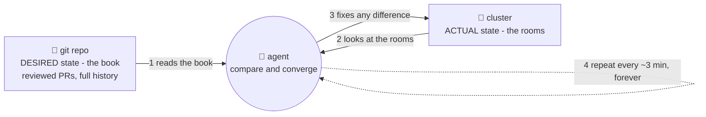

# 📖 Lesson 05 — The GitOps idea: reality must match the book

**📍 You are here:** Lesson **05** of 12 — Part 2 begins! · Previous: `lesson-04-limits-of-push` · Next: `lesson-06-install-argocd`

---

## 📦 What's in this branch

Lessons 01–04, **plus** the big idea that fixes all four gaps at once:
**GitOps** — git as the single source of truth, enforced by an agent that
lives inside the cluster.

## 🧒 Explain like I'm 5

The school writes ONE **master plan book** 📖 and keeps it in the library
(git). The book says exactly how every room should look: chairs, posters,
plant-waterers, projector positions.

And here's the trick — the school hires a **caretaker** 🤖 who *lives in the
building* and has one job, repeated forever:

> Read the book. Walk the halls. **Make the rooms match the book.** Repeat.

Now *everything* changes shape:

- Want a different room? **Don't touch the room — edit the book.** The
  caretaker will make it real.
- A kid rearranges chairs? Caretaker puts them back within minutes. The
  room *can't* drift, because someone compares it to the book all day.
- "What does Room 3B look like?" — **read the book.** It's always true.
- Yesterday's layout was better? **Flip back one page.** Caretaker obliges.
- And the school's keys? They **never leave the building** — the caretaker
  works from inside. 🔑🏫

Four gaps from lesson 04. Four fixes. One idea.

## 🗺️ Diagram



## ❓ What

**GitOps** = four rules (as codified by the OpenGitOps project):

1. **Declarative** — the whole system is described as files (you've had this
   since lesson 01 — your k8s/ folder).
2. **Versioned & immutable** — those files live in git: history, blame,
   review, revert.
3. **Pulled automatically** — an agent *inside* the cluster fetches the
   desired state itself. No outside system pushes with a key.
4. **Continuously reconciled** — the agent compares & converges *forever*,
   not just at deploy moments.

Rules 1–2 you already had. Rules 3–4 are the new superpowers — and if they
sound familiar: it's **exactly** how a Deployment treats "replicas: 2"
(k8s course, lesson 03). GitOps applies the same reconcile loop to your
*entire cluster*, with git as the desired state.

## 🤔 Why

Because it converts the four push-model gaps into non-problems:
drift → reverted continuously · keys in CI → agent pulls from inside ·
ten clusters → ten agents, each pulling the same repo · "what's running?" →
`git log`. Deploys stop being *events somebody performs* and become
*facts somebody committed*.

## 🔧 How (in this repo)

Nothing to install yet — this lesson is the mental model. But notice the
repo is already GitOps-shaped: [k8s/](../../k8s/) is a complete declarative
description of the app (rule 1), versioned in git (rule 2). Lessons 06–07
add the agent (rules 3–4): ArgoCD + one
[Application](../../argocd/application.yaml) file.

## 🧪 Try it (a paper exercise, 2 minutes)

```bash
# GitOps quiz — answer each with "edit the book" or "touch the room":
#   Q1: you want 3 replicas instead of 2            → ?
#   Q2: prod is on fire, revert last night's change → ?
#   Q3: auditor asks who changed the memory limit   → ?
# answers: book (git commit), book (git revert), book (git log -p k8s/)
git log --oneline -- k8s/    # ← the book's history: your future deploy log
```

## ⏭️ Next

Time to hire the caretaker. **ArgoCD** installs into your cluster with one
command.

```bash
git checkout lesson-06-install-argocd
```
