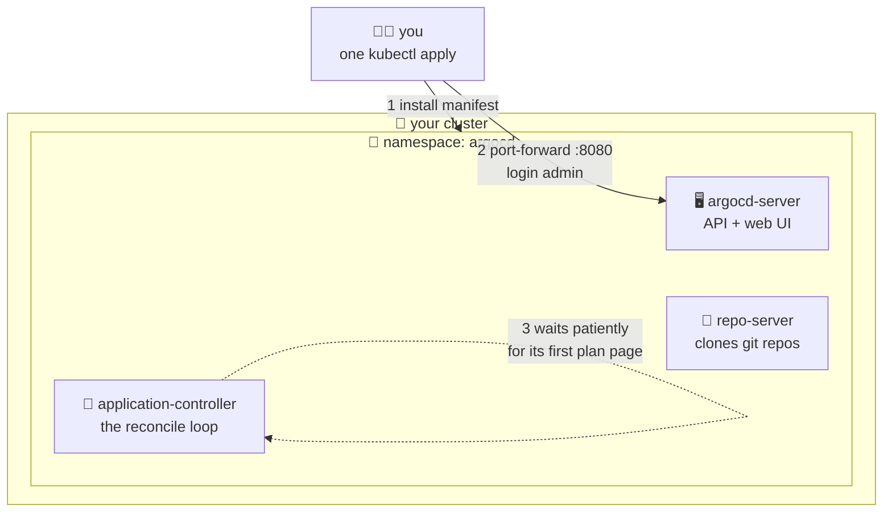

# 🤖 Lesson 06 — Install ArgoCD: the robot moves into the school

**📍 You are here:** Lesson **06** of 12 · Previous: `lesson-05-gitops-idea` · Next: `lesson-07-first-application`

---

## 📦 What's in this branch

Lessons 01–05, **plus**: installing **ArgoCD** into your local cluster and
taking the tour — UI, CLI, and what each moving part does.

## 🧒 Explain like I'm 5

Hiring day! 🎉 The caretaker robot 🤖 arrives in one big box (a single install
manifest). You open the box inside the school, and out come its parts:

- **Its eyes and face** 🖥️ (`argocd-server` + web UI) — the window where YOU
  see what the robot sees: green rooms, yellow rooms, diffs.
- **Its library card** 📖 (`repo-server`) — the part that walks to the
  library and fetches the plan book (clones git repos).
- **Its legs and hands** 🔄 (`application-controller`) — the part that walks
  the halls comparing rooms to the book and fixing differences. This is the
  reconcile loop itself.

Important hiring details: the robot lives in its **own room**
(namespace `argocd`), and it starts with **zero opinions** — it does nothing
until you hand it its first plan page (lesson 07).

## 🗺️ Diagram



## ❓ What

- ArgoCD is a **CNCF-graduated** GitOps controller for Kubernetes — the most
  popular one (Flux is the other big name; same idea, no built-in UI).
- It extends Kubernetes with new resource types — most importantly
  **Application** (lesson 07) — and reconciles them like Kubernetes
  reconciles Deployments.
- The UI is genuinely excellent and half the reason ArgoCD won: you *see*
  the app tree (Application → Deployment → ReplicaSet → Pods), sync status,
  live diffs, and history.

## 🤔 Why install it per cluster?

Because pull-based means **each cluster guards itself**: its agent, its keys
staying inside, its view of the book. (One ArgoCD can also manage many
clusters centrally — a valid setup with trade-offs; learn the simple shape
first.)

## 🔧 How + 🧪 Try it

```bash
# 1) hire the robot (any local cluster):
kubectl create namespace argocd
kubectl apply -n argocd -f https://raw.githubusercontent.com/argoproj/argo-cd/stable/manifests/install.yaml

# 2) wait for its parts to assemble:
kubectl -n argocd get pods -w        # ~1–2 min until all Running; Ctrl+C

# 3) open its face:
kubectl -n argocd port-forward svc/argocd-server 8080:443 &
kubectl -n argocd get secret argocd-initial-admin-secret \
  -o jsonpath='{.data.password}' | base64 -d; echo
# browse https://localhost:8080 → login: admin + that password
# (self-signed cert warning is expected locally — proceed)

# 4) optional but nice — the CLI:
brew install argocd
argocd login localhost:8080 --username admin --insecure

# 5) look around the UI: zero Applications. The robot is hired,
#    bored, and waiting for lesson 07. 🤖💤
```

## ⏭️ Next

Hand the robot its first plan page: the **Application** that deploys this
very repo.

```bash
git checkout lesson-07-first-application
```
