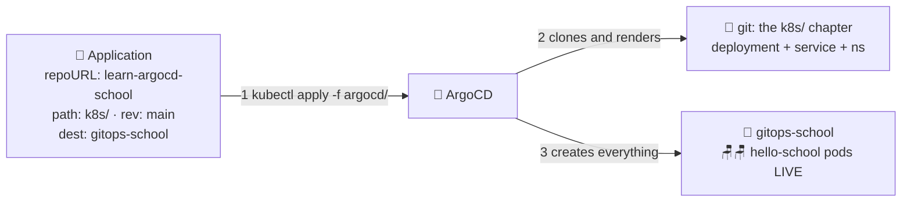

# 📄 Lesson 07 — The first Application: one page of the plan book

**📍 You are here:** Lesson **07** of 12 · Previous: `lesson-06-install-argocd` · Next: `lesson-08-sync-policies`

---

## 📦 What's in this branch

Lessons 01–06, **plus** the moment it all clicks: an **Application** resource
that makes ArgoCD deploy this repo's `k8s/` folder — and from then on, you
never `kubectl apply` the app again. Real file:

- [argocd/application.yaml](../../argocd/application.yaml) — the plan page, deployable as-is

## 🧒 Explain like I'm 5

The robot is hired but idle. You hand it **one page of the plan book** 📄
with exactly three facts on it:

1. **Which book** 📖 — "the one in the library called *learn-argocd-school*"
   (the git `repoURL`).
2. **Which chapter** — "read the *k8s/* chapter, `main` edition" (the `path`
   and `targetRevision`).
3. **Which room** 🚪 — "make classroom *gitops-school* in THIS building match
   it" (the `destination`).

The robot reads the page, walks to the library, fetches the chapter, walks to
the room… and **builds it**: namespace, deployment, service, pods. You never
carried anything. 🎒❌

And the deep magic: the page never expires. The robot re-reads the chapter
every few minutes, forever. Editing the chapter (a git commit) is now the
ONLY way anyone changes that room — which is exactly what you want.

## 🗺️ Diagram



## ❓ What

- **Application** = ArgoCD's own resource type: *source* (repo/path/revision)
  + *destination* (cluster/namespace) + *policy* (lesson 08).
- ArgoCD compares the rendered manifests against the live cluster and shows
  the result as a status: **Synced** ✅ (matches) or **OutOfSync** 🟡
  (differs) — plus Healthy/Progressing/Degraded from the workloads.
- Public repos need no credentials — the robot's library card just works.
  (Private repos: add a repo secret; the idea is identical.)

## 🤔 Why

This single file replaces: your `kubectl apply` ritual, the pipeline's
deploy job, the "what's deployed?" spreadsheet, and the 3 AM "is prod what's
in git?" doubt. One page → the robot owns that room forever.

> ✅ **Gap 2 closed.** Nothing outside the cluster holds deployment credentials any more: the robot pulls the book from inside, using only its library card (read access to git). Your CI can lose its kubeconfig entirely.

## 🔧 How (the file, annotated)

```yaml
spec:
  source:
    repoURL: https://github.com/BaluRaut/learn-argocd-school.git
    targetRevision: main       # which edition to follow (branch/tag)
    path: k8s                  # which chapter (folder of manifests)
  destination:
    server: https://kubernetes.default.svc   # this very cluster
    namespace: gitops-school
  syncPolicy:
    automated: { prune: true, selfHeal: true }   # lesson 08 explains these
    syncOptions: [CreateNamespace=true]
```

## 🧪 Try it

```bash
# clean slate makes the magic obvious — delete the hand-deployed app first:
kubectl delete namespace gitops-school --ignore-not-found

# hand the robot the page:
kubectl apply -f argocd/application.yaml

# watch it work (UI: the hello-school app appears and turns green), or:
kubectl -n argocd get application hello-school -w    # OutOfSync → Synced; Ctrl+C
kubectl -n gitops-school get all                     # the room, built by the robot 🎉

# proof you're out of the loop now:
kubectl -n gitops-school delete deployment hello-school
kubectl -n gitops-school get deploy -w               # ...it comes BACK. (lesson 08 tells you why)
```

## ✅ Verify — what you should see

`kubectl -n argocd get application hello-school` → `SYNC STATUS: Synced`, `HEALTH STATUS: Healthy` within a minute or two. It passes through `OutOfSync` / `Progressing` first — that transition *is* the lesson. `kubectl -n gitops-school get all` shows the namespace, Deployment, Service and two pods the robot built; in the UI the tile is green with the tree Application → Deployment → ReplicaSet → Pods.

## 🧹 Clean up

Keep the Application for lessons 08–12. Removing it later: `kubectl -n argocd delete application hello-school` leaves the deployed resources in place unless the Application carries the `resources-finalizer.argocd.argoproj.io` finalizer (`argocd app delete hello-school --cascade` adds it). Then `kubectl delete namespace gitops-school` for anything left.

## ⚠️ Common mistakes

- `path:` with a typo or a trailing slash → `ComparisonError` — check the tile's error text first
- `CreateNamespace=true` missing → the first sync fails because the namespace does not exist
- expecting an instant sync after a push — the default poll is ~3 minutes; click Refresh, or add a webhook
- editing the app's resources by hand and being surprised (lesson 08 explains selfHeal)

> 🏭 **Why this matters in production:** the Application is just YAML, so it lives in git too (app-of-apps, lesson 11) — nobody `kubectl apply`s Applications by hand either. Private repos need a repo credential (deploy key or GitHub App) stored *in the cluster*, not in CI.

## ⏭️ Next

`automated`, `prune`, `selfHeal` — the robot's house rules, and when to
loosen them.

```bash
git checkout lesson-08-sync-policies
```
