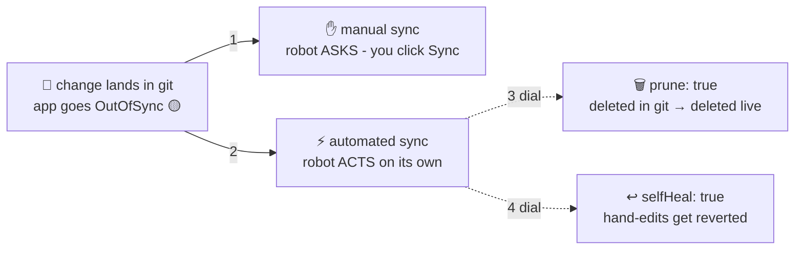

# 📏 Lesson 08 — Sync policies: how strictly the robot follows the book

**📍 You are here:** Lesson **08** of 12 · Previous: `lesson-07-first-application` · Next: `lesson-09-self-heal-drift`

---

## 📦 What's in this branch

Lessons 01–07, **plus** the robot's obedience settings: **manual vs automated
sync**, and the two strictness dials — **prune** and **selfHeal**.

## 🧒 Explain like I'm 5

Every caretaker robot needs **house rules** 📏. Yours has one big switch and
two dials:

**The big switch — when the book changes, does the robot…**
- **…ASK first?** ✋ ("manual sync") — it notices the room no longer matches
  the new page, hangs a yellow "OutOfSync" sign, and *waits for you to nod*
  (click **Sync**). Nothing changes without your click.
- **…just DO it?** ⚡ ("automated sync") — it fixes the room the moment the
  book changes. No nodding needed.

**Dial 1 — prune** 🗑️: a poster was *removed* from the book. May the robot
take the real poster off the wall? Off = it only adds/updates, never removes
(safe but leaves orphans). On = the book fully rules — gone from the book,
gone from the room.

**Dial 2 — selfHeal** ↩️: a *kid* (not the book!) moved the chairs. May the
robot move them back? Off = it just hangs the yellow sign. On = chairs go
back within minutes, every time.

Start with everything gentle while learning. In production, turn on
**automated**, then **selfHeal**, then **prune** — deliberately, one dial at a
time, with safeguards (reviewed PRs, CI validation, a backup you have tested).
Prune in particular can delete real resources, so it earns its place last.

## 🗺️ Diagram



## ❓ What

```yaml
syncPolicy:
  automated:          # omit this whole block = manual sync
    prune: true       # default false: never delete unless told
    selfHeal: true    # default false: report drift, don't revert it
```

- **OutOfSync** is a *comparison result*, not an error — "book ≠ room".
- Without `prune`, resources removed from git linger forever (and confuse
  everyone later). Without `selfHeal`, drift is *visible* but not *fixed* —
  already better than Part 1, where it was invisible!
- Escape hatches exist for special cases: annotations for sync order
  (waves/hooks) and for ignoring specific diffs (e.g. a replica count that
  an HPA owns — you'd ignore that field). Know they exist; don't start there.

- **When NOT to automate yet:** the repo has no review or CI validation; the
  app owns state you cannot recreate (prune territory — a PVC removed from git
  is data gone); an HPA or operator writes fields you have not told ArgoCD to
  ignore (selfHeal would fight it); or you are still learning what OutOfSync
  looks like. Manual sync is a feature, not a failure.

## 🤔 Why not always strictest?

Because strictness transfers power from humans to the book — which is only
good once the book is *trustworthy* (reviewed PRs, CI validation). Teams
usually walk the ladder: manual → automated → +prune → +selfHeal, gaining
confidence at each rung. The demo app's
[application.yaml](../../argocd/application.yaml) ships fully strict because
it's a playground — flip things off and feel the difference.

## 🧪 Try it

```bash
# A) feel MANUAL mode — turn automation off:
kubectl -n argocd patch application hello-school --type merge \
  -p '{"spec":{"syncPolicy":null}}'
kubectl -n gitops-school scale deployment hello-school --replicas=3
kubectl -n argocd get application hello-school    # OutOfSync 🟡 — but nothing happens
# in the UI: yellow app, a diff view, and a Sync button waiting for your nod

# B) nod (sync it) via CLI or the UI button:
argocd app sync hello-school 2>/dev/null || echo "or click Sync in the UI"

# C) restore full strictness for the next lessons:
kubectl -n argocd patch application hello-school --type merge \
  -p '{"spec":{"syncPolicy":{"automated":{"prune":true,"selfHeal":true},"syncOptions":["CreateNamespace=true"]}}}'
```

## ✅ Verify — what you should see

Step A: after removing `syncPolicy` and scaling to 3, `kubectl -n argocd get application hello-school` shows `OutOfSync` and *stays* that way; the UI shows a yellow tile, a Diff view with `replicas: 2 → 3`, and a **Sync** button. Step B: after syncing, `Synced` and 2 pods. Step C: fully automated again — scale once more and watch it revert.

## 🧹 Clean up

Make sure step C ran (automated + prune + selfHeal restored) or lessons 09–10 behave differently. Nothing else to remove.

## ⚠️ Common mistakes

- turning on `prune` first — a resource you removed from git *on purpose to keep it* disappears
- `selfHeal` fighting an HPA or an operator that writes `replicas` or status fields — add `ignoreDifferences` (lesson 09)
- reading `OutOfSync` as an error and "fixing" it with kubectl — the fix is a sync or a commit
- leaving a production app on manual sync forever because nobody trusts the book — fix the review process, then flip the switch

> 🏭 **Why this matters in production:** most teams run automated + selfHeal, and add prune per app once all of its resources are in git; sync waves and hooks order the sync (CRDs and namespaces first, migrations before Deployments). Start manual while learning; turn each dial on deliberately, with safeguards.

## ⏭️ Next

With selfHeal on, let's have a proper fight with the robot — and lose,
in seconds, live.

```bash
git checkout lesson-09-self-heal-drift
```
