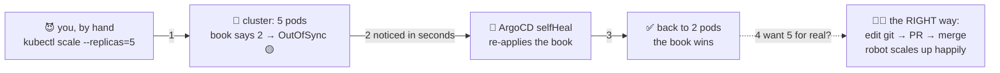

# 🪑↩️ Lesson 09 — Self-heal: the chairs go back where the book says

**📍 You are here:** Lesson **09** of 12 · Previous: `lesson-08-sync-policies` · Next: `lesson-10-rollback-history`

---

## 📦 What's in this branch

Lessons 01–08, **plus** the payoff for lesson 02's pain: watching ArgoCD
**detect and revert drift in seconds** — then learning the correct way to
make changes (edit the book!).

## 🧒 Explain like I'm 5

Remember lesson 02? A kid moved the chairs, nobody noticed for three months,
and one day a "reset" destroyed every unrecorded fix. 😱

Same school, new caretaker. A kid moves the chairs at 15:00…

- **15:00:30** — the robot's hall-walk reaches the room. Book says 2 chairs
  at the front; room has 5. **Yellow sign goes up instantly.** 🟡
- **15:00:31** — selfHeal is on, so the robot doesn't just report — it
  **moves the chairs back**. Room matches book. Done. ↩️
- The kid tries again. Same result. The kid learns the real lesson: 🧑‍🎓
  *"if I want 5 chairs, I have to get it written into the book"* — a git
  commit, reviewed and merged. Then the robot happily builds 5 chairs,
  **and the book stays true**.

Drift didn't become forbidden — it became **impossible to sustain**. That's
the difference between a rule and a reconcile loop.

## 🗺️ Diagram



## ❓ What

- ArgoCD refreshes its comparison about **every 3 minutes** (plus instantly
  on webhooks/UI refresh), and selfHeal reverts detected drift right away.
- What counts as drift: *any* live difference from rendered git state —
  scale changes, edited env vars, deleted resources (prune territory),
  added labels…
- Legitimate exceptions exist: if an **HPA** owns `replicas` (k8s course,
  lesson 09!), you tell ArgoCD to ignore that one field
  (`spec.ignoreDifferences`) — otherwise robot and HPA would tug-of-war.
  The general rule stands: *fields humans own live in git.*

## 🤔 Why this is the killer feature

Lesson 04, gap #1 — "nobody watches the room between deploys" — is now
simply false: something watches every room, every few minutes, forever, and
its idea of "correct" is the reviewed, versioned book. Incidents shrink from
"three months of mystery edits" to "the diff ArgoCD showed at 15:00:30".

> ✅ **Gap 1 closed.** Drift is detected within one refresh (~3 minutes, or seconds with a webhook) and, with selfHeal, reverted — the room can no longer quietly disagree with the book.

## 🔧 How (nothing new to configure!)

You already have it: `selfHeal: true` in
[argocd/application.yaml](../../argocd/application.yaml) (lesson 08). This
lesson is pure demonstration.

## 🧪 Try it — pick a fight with the robot

```bash
# round 1: FIGHT!
kubectl -n gitops-school scale deployment hello-school --replicas=5
kubectl -n gitops-school get pods -w
# ...watch the extra pods appear — and then get terminated within moments. Ctrl+C.

# round 2: sneakier — edit an env-ish detail:
kubectl -n gitops-school patch deployment hello-school --type merge \
  -p '{"spec":{"template":{"metadata":{"labels":{"hacked":"true"}}}}}'
kubectl -n gitops-school get deploy hello-school -o jsonpath='{.spec.template.metadata.labels}'
# wait ~a moment, check again: the label is GONE. The book wins. 🤖

# round 3: do it RIGHT — on your own fork:
#   edit k8s/deployment.yaml → replicas: 3 → commit & push
#   (point your Application's repoURL at your fork first)
# → within ~3 min: 3 pods, no fight, and git shows who wanted 3 and why. 🎉
```

## ✅ Verify — what you should see

Round 1: `kubectl -n gitops-school get pods -w` shows three extra pods appear and then go `Terminating` within moments (up to a few minutes without a webhook). Round 2: the `hacked` label is gone on the second check. `kubectl -n argocd get application hello-school` never *stays* `OutOfSync`. Round 3 (your fork): 3 pods, and `git log` shows who wanted them.

## 🧹 Clean up

Nothing to remove — the robot already cleaned up after you. Round 3 lives in *your* fork's git history, which is the point.

## ⚠️ Common mistakes

- concluding selfHeal is broken because the revert took 2–3 minutes — that is the refresh interval; a webhook makes it seconds
- fighting the HPA: if `replicas` is owned by an autoscaler, ignore that field (`spec.ignoreDifferences`) or drop `replicas` from the manifest
- using selfHeal as a reason to stop reviewing PRs — the book wins, so a bad book wins too

> 🏭 **Why this matters in production:** selfHeal turns "somebody changed prod by hand" from a mystery into a diff with a timestamp. Pair it with RBAC (Kubernetes school L17) that makes hand edits rare, and alert on repeated OutOfSync → Synced flips — they mean someone is fighting the robot.

## ⏭️ Next

If the book always wins… then going **back in time in the book** must be a
rollback. It is — and it's glorious.

```bash
git checkout lesson-10-rollback-history
```
