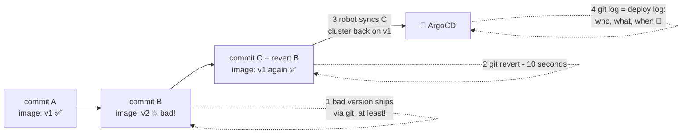

# ⏪ Lesson 10 — Rollback & history: flip the book to yesterday's page

**📍 You are here:** Lesson **10** of 12 · Previous: `lesson-09-self-heal-drift` · Next: `lesson-11-helm-kustomize-envs`

---

## 📦 What's in this branch

Lessons 01–09, **plus** the calmest superpower in operations: in GitOps,
**rollback is just `git revert`** — and your audit trail writes itself.

## 🧒 Explain like I'm 5

Tuesday's page of the book said "paint Room 3B blue". The room turned blue.
Wednesday everyone agrees: the blue is *hideous*. 🎨😱

Old world: panic, find the old paint can, remember the old color, repaint by
hand at midnight, hope you remembered right.

Book world: **flip back one page.** 📖⏪ Write a new page that says exactly
what Monday's page said (that's `git revert` — it doesn't erase Wednesday's
mistake, it adds a page "undo Wednesday"). The caretaker reads it and calmly
repaints. Ten seconds of human work.

And the school's logbook? You never wrote one — but the book's page history
**is** the logbook: every change, who made it, when, and why (the commit
message). The auditor 🕵️ reads git and goes home early.

## 🗺️ Diagram



## ❓ What

- **`git revert <sha>`** creates a *new* commit that undoes an old one —
  history stays intact (never force-push your deploy repo!). ArgoCD sees the
  new commit and syncs; the cluster walks backward calmly, with the same
  rolling-update safety as any deploy.
- **ArgoCD's own History & Rollback button** exists too (it can re-sync a
  previous revision) — great in a fire drill. But note: rolling back via the
  UI while `automated` sync is on gets overridden by the book again — the
  durable rollback is the git revert. **The book must change.**
- Audit: `git log -p k8s/` answers who/what/when; the PR answers *why*.
  Compare that with reconstructing a timeline from CI logs + kubectl events.

## 🤔 Why this beats pipeline rollbacks

A pipeline rollback is a *new forward action* (re-run with old parameters —
hope they're still valid). A GitOps rollback is a *state declaration*:
"desired = what it was". No pipeline re-run, no stale parameters, no
"deploy job is broken and it's also the rollback tool" single point of
failure. And it works identically across 1 or 50 clusters.

## 🔧 How (in this repo)

The demo Deployment pins `image: nginxdemos/hello:plain-text` in
[k8s/deployment.yaml](../../k8s/deployment.yaml). Changing that line in git
IS a deploy; reverting that commit IS a rollback. That's the entire
mechanism. (This is also why GitOps repos pin **specific tags**, never
`:latest` — a floating tag hides what's actually running, and "revert"
would revert nothing.)

## 🧪 Try it (on your fork)

```bash
# point your Application at YOUR fork first (lesson 07), then:

# 1) ship a "bad" version — change the image tag in k8s/deployment.yaml:
#      image: nginxdemos/hello:latest        # pretend this one is broken
git add k8s/deployment.yaml && git commit -m "ship v2" && git push
kubectl -n gitops-school get pods -w          # rollout happens by itself; Ctrl+C

# 2) uh oh. roll back in one move:
git revert --no-edit HEAD && git push
kubectl -n gitops-school get pods -w          # ...and it calmly walks back. 🎉

# 3) read your free audit log:
git log --oneline -- k8s/                     # every deploy, forever
```

## ⏭️ Next

One app in one room is lovely — but real life is dev/staging/prod and ten
services. Templates and the app-of-apps pattern.

```bash
git checkout lesson-11-helm-kustomize-envs
```
