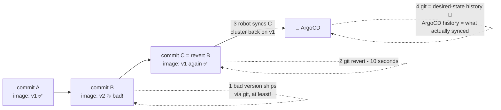

# ⏪ Lesson 10 — Rollback & history: flip the book to yesterday's page

**📍 You are here:** Lesson **10** of 12 · Previous: `lesson-09-self-heal-drift` · Next: `lesson-11-helm-kustomize-envs`

---

## 📦 What's in this branch

Lessons 01–09, **plus** the calmest superpower in operations: in GitOps,
**rollback is just `git revert`** — and your audit trail writes itself.

## 🧒 Explain like I'm 5

Tuesday's page of the book said "paint Room 3B blue". The room turned blue.
Wednesday everyone agrees: the blue is *hideous*. 🎨😱

Old world: panic, find the old paint can, remember the old color, repaint by
hand at midnight, hope you remembered right.

Book world: **flip back one page.** 📖⏪ Write a new page that says exactly
what Monday's page said (that's `git revert` — it doesn't erase Wednesday's
mistake, it adds a page "undo Wednesday"). The caretaker reads it and calmly
repaints. Ten seconds of human work.

And the school's logbook? The book's page history is the record of every
*request*: who changed which page, when, and why (the commit message). The
caretaker keeps a second, shorter note of what it *actually did* and when —
ArgoCD's sync history. The auditor 🕵️ reads both and goes home early.

## 🗺️ Diagram



## ❓ What

- **`git revert <sha>`** creates a *new* commit that undoes an old one —
  history stays intact (never force-push your deploy repo!). ArgoCD sees the
  new commit and syncs; the cluster walks backward calmly, with the same
  rolling-update safety as any deploy.
- **ArgoCD's own History & Rollback button** exists too (it can re-sync a
  previous revision) — great in a fire drill. But note: rolling back via the
  UI while `automated` sync is on gets overridden by the book again — the
  durable rollback is the git revert. **The book must change.**
- Two histories, not one. **Git history = desired-state change history**
  (`git log -p k8s/` — who/what/when; the PR says *why*). **ArgoCD's sync
  history = what was actually synced** (`argocd app history hello-school`,
  or the History tab): a sync can fail, wait for a manual nod, or land minutes
  later, and git knows nothing about that. Together they replace
  reconstructing a timeline from CI logs + kubectl events.

## 🤔 Why this beats pipeline rollbacks

A pipeline rollback is a *new forward action* (re-run with old parameters —
hope they're still valid). A GitOps rollback is a *state declaration*:
"desired = what it was". No pipeline re-run, no stale parameters, no
"deploy job is broken and it's also the rollback tool" single point of
failure. And it works identically across 1 or 50 clusters.

> ✅ **Gap 4 closed.** "What's in Room 3B right now?" is no longer answered by a mailroom log of what was *sent*: the book is the live truth (Synced ✅ means room == page), and the sync history says when each page was actually applied.

## 🔧 How (in this repo)

The demo Deployment pins `image: nginxdemos/hello:plain-text` in
[k8s/deployment.yaml](../../k8s/deployment.yaml). Changing that line in git
IS a deploy; reverting that commit IS a rollback. That's the entire
mechanism. (This is also why GitOps repos pin **specific tags**, never
`:latest` — a floating tag hides what's actually running, and "revert"
would revert nothing.)

## 🧪 Try it (on your fork)

```bash
# point your Application at YOUR fork first (lesson 07), then:

# 1) ship a "bad" version — change the image tag in k8s/deployment.yaml:
#      image: nginxdemos/hello:latest        # pretend this one is broken
git add k8s/deployment.yaml && git commit -m "ship v2" && git push
kubectl -n gitops-school get pods -w          # rollout happens by itself; Ctrl+C

# 2) uh oh. roll back in one move:
git revert --no-edit HEAD && git push
kubectl -n gitops-school get pods -w          # ...and it calmly walks back. 🎉

# 3) read your free audit log:
git log --oneline -- k8s/                     # every desired-state change, forever
argocd app history hello-school 2>/dev/null || echo "or: UI → hello-school → History"   # what actually synced
```

## ✅ Verify — what you should see

After the bad commit: `kubectl -n gitops-school get deploy hello-school -o jsonpath='{.spec.template.spec.containers[0].image}'` shows the new tag within ~3 minutes. After `git revert` + push: the old tag again, through a normal rolling update. `argocd app history hello-school` (or the History tab) lists both syncs with their git SHAs — that is the record of what actually ran.

## 🧹 Clean up

Your fork now carries two extra commits — the change and its revert. That *is* the audit trail; keep it. Nothing in the cluster to clean.

## ⚠️ Common mistakes

- rolling back with the UI's Rollback button while automated sync is on — the book re-applies the bad commit within minutes; the durable rollback is the revert
- `git reset --hard` + force-push to "undo" — you destroy the history that made the rollback trustworthy
- pinning `:latest` — a revert changes nothing because the tag did not change
- reading git history as proof that something *ran* — sync history says what actually synced, and when

> 🏭 **Why this matters in production:** a GitOps rollback is a PR like any other, which is exactly why it is calm: same review, same checks, same audit. Keep the image tag in a small separate file (or a values file) so a revert touches one line.

## ⏭️ Next

One app in one room is lovely — but real life is dev/staging/prod and ten
services. Templates and the app-of-apps pattern.

```bash
git checkout lesson-11-helm-kustomize-envs
```
