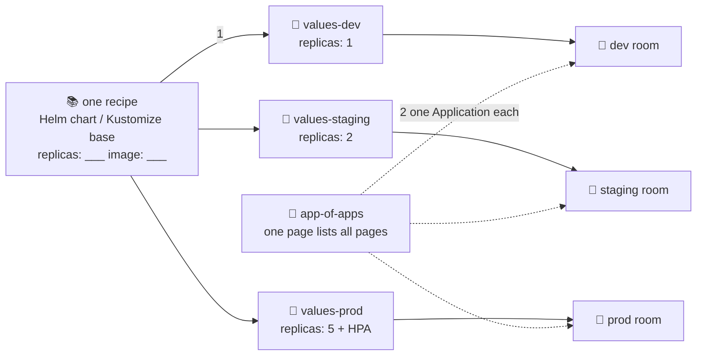

# 📚 Lesson 11 — Helm, Kustomize & environments: one recipe, many classrooms

**📍 You are here:** Lesson **11** of 12 · Previous: `lesson-10-rollback-history` · Next: `lesson-12-secrets-and-compare`

---

## 📦 What's in this branch

Lessons 01–10, **plus** how GitOps scales past one app in one namespace:
**templates** (Helm / Kustomize), **per-environment values**, and the
**app-of-apps** pattern.

## 🧒 Explain like I'm 5

The school now has **three classrooms** that should look *almost* the same:
the practice room (dev), the dress-rehearsal room (staging), and the big
stage (prod). 🚪🚪🚪

Copying the plan chapter three times is a trap — fix a typo in one copy,
forget the other two, and the rooms slowly disagree (copy-paste drift!).

Better: write **one recipe with blanks** 📚:

> "___ chairs, projector: ___, posters: ___"

…and three small **fill-in pages**: practice room = 1 chair; rehearsal = 2;
big stage = 5 chairs + fancy lights. One recipe, three fill-ins, three rooms.
Fix the recipe once → all three rooms improve.

- **Helm** = recipes with blanks (`{{ .Values.replicas }}`) + values files.
- **Kustomize** = a full example room (base) + small "differences" pages
  (overlays: "same as base, but 5 chairs").

And when you have ten apps × three rooms? Write a **master page that lists
the other pages** 📖 — an Application whose chapter contains *more
Application files*. Hand the robot ONE page; it discovers the rest itself.
That's **app-of-apps** — how whole platforms bootstrap from a single
`kubectl apply`.

## 🗺️ Diagram



## ❓ What

- ArgoCD renders sources natively: plain YAML (what we've used), **Helm**
  (`source.helm.valueFiles`), **Kustomize** (point `path:` at an overlay).
  Same Application shape, different chapter format.
- **Per-env promotion** becomes a git operation: bump the image tag in
  `values-staging.yaml`, test, then PR the same bump into
  `values-prod.yaml`. The diff between environments is *readable in git*.
- **App-of-apps**: an Application pointing at a folder of Application
  manifests. Delete a leaf app from the folder → (with prune) it vanishes
  from the cluster. One page rules them all.
- (Modern cousin: **ApplicationSets** generate Applications from lists/
  clusters/PRs — meet it after app-of-apps makes sense.)

## 🤔 Why

Copy-paste is how config rots. Templates + tiny per-env diffs keep the
*intent* ("prod is base + 5 replicas + HPA") readable and reviewable. And
app-of-apps means disaster recovery for an entire platform is: install
ArgoCD, apply one file, wait. ☕

## 🔧 How (a Kustomize sketch of THIS repo)

```
k8s/
├── base/                    # the recipe: deployment + service + ns
│   └── kustomization.yaml
└── overlays/
    ├── dev/kustomization.yaml       # replicas: 1
    └── prod/kustomization.yaml      # replicas: 5
```
Two Applications, identical except `path: k8s/overlays/dev` vs
`.../prod` and the destination namespace. (Left as the course's take-home
exercise — you have every tool needed.)

## 🧪 Try it (feel Kustomize in 2 minutes, no ArgoCD needed)

```bash
mkdir -p /tmp/kdemo/base /tmp/kdemo/prod
cp k8s/deployment.yaml k8s/service.yaml /tmp/kdemo/base/
printf 'resources: [deployment.yaml, service.yaml]\n' > /tmp/kdemo/base/kustomization.yaml
printf 'resources: ["../base"]\nreplicas: [{name: hello-school, count: 5}]\n' > /tmp/kdemo/prod/kustomization.yaml

kubectl kustomize /tmp/kdemo/base | grep replicas     # → 2 (the recipe)
kubectl kustomize /tmp/kdemo/prod | grep replicas     # → 5 (base + one fill-in line!)
```

## ⏭️ Next

One last dragon: **secrets** — the one thing that must NOT live plainly in
the book — plus the final push-vs-pull scorecard.

```bash
git checkout lesson-12-secrets-and-compare
```
