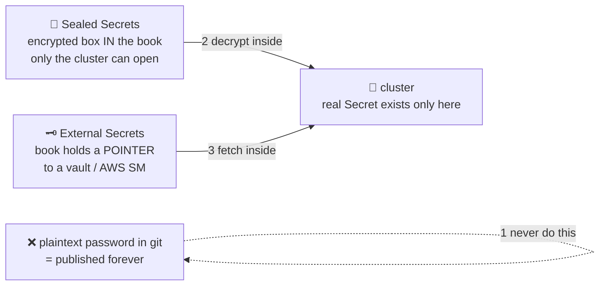

# 🔑 Lesson 12 — Secrets in GitOps + the final scorecard

**📍 You are here:** Lesson **12** of 12 — the final lesson! · Previous: `lesson-11-helm-kustomize-envs`

---

## 📦 What's in this branch

All 12 lessons — the complete course. The last dragon: **secrets** (the one
thing that must never sit plainly in the book), then the final
**with-vs-without-ArgoCD scorecard**.

## 🧒 Explain like I'm 5

The book 📖 is wonderful *because* everyone can read it. Which is exactly why
you must **never glue the locker key inside it**. 🔑❌ A password pasted into
git is a password published — forever (git never forgets, even after you
"delete" it).

Two honest ways to handle keys in a book-world:

1. **A locked box glued into the book** 🔐 (Sealed Secrets): you lock the key
   in a box that **only your school's caretaker** can open, and glue the BOX
   into the book. Everyone can see there's a box; only the robot inside the
   cluster can open it. Safe to publish, still fully GitOps.
2. **A note saying where the key is kept** 🗝️ (External Secrets Operator):
   the book only says *"key #42 from the bank vault"* (AWS Secrets Manager,
   Vault…). A helper inside the school fetches it and hands it to the right
   room. The book stays clean; the vault does vault things (rotation!).

Same rule as the k8s course, lesson 06 — notice board vs locker key —
now applied to the book itself.

## 🗺️ Diagram



## ❓ What

- Our demo app dodged the dragon on purpose (no DB) — but the k8s course's
  `secret.example.yaml` trick (real file git-ignored) does NOT work in
  GitOps: if it's not in the book, the robot doesn't manage it.
- **Sealed Secrets**: a controller with a private key; you encrypt with
  `kubeseal`; the `SealedSecret` goes in git; it becomes a real `Secret`
  only in-cluster. Simple, self-contained.
- **External Secrets Operator (ESO)**: `ExternalSecret` in git references a
  path in a real secret store; ESO syncs it into a `Secret`. Best with
  cloud stores + rotation. (SOPS + age is a third path, same spirit.)

## 🔧 How (a minimal Sealed Secret, end to end)

> 🔑 **Rule of thumb:** never commit a plaintext Secret — not "just for dev", not base64 (that is encoding, not encryption). Either encrypt it *into* the book (Sealed Secrets, SOPS) or keep only a *pointer* in the book (External Secrets Operator).

```bash
# 1) install the controller once per cluster (it generates the cluster's key pair):
kubectl apply -f https://github.com/bitnami-labs/sealed-secrets/releases/latest/download/controller.yaml
brew install kubeseal            # the CLI that encrypts with the cluster's PUBLIC key

# 2) write the plain Secret locally — NEVER commit this file:
kubectl -n gitops-school create secret generic db-pass \
  --from-literal=password='SuperSecret123' --dry-run=client -o yaml > /tmp/db-pass.yaml

# 3) seal it — the output is safe to commit:
kubeseal --format yaml < /tmp/db-pass.yaml > k8s/db-pass.sealed.yaml
rm /tmp/db-pass.yaml
git add k8s/db-pass.sealed.yaml && git commit -m "add db password (sealed)"

# 4) ArgoCD syncs the SealedSecret; the controller turns it into a real Secret in-cluster:
kubectl -n gitops-school get sealedsecret,secret db-pass
```

[argocd/examples/sealed-secret.example.yaml](../../argocd/examples/sealed-secret.example.yaml) shows what the committed file looks like, and [argocd/examples/external-secret.example.yaml](../../argocd/examples/external-secret.example.yaml) is the ESO equivalent: an `ExternalSecret` that names a key in AWS Secrets Manager and lets the operator create the `Secret` inside the cluster.

## 🚪 The four gaps of push — closed

| Gap (lesson 04) | Closed by | Lesson |
|---|---|---|
| 1 — drift between deploys is invisible | selfHeal on a ~3-minute reconcile loop | 09 |
| 2 — deployment credentials must come from outside | the robot pulls from inside; CI keeps no way into the cluster | 07 |
| 3 — every extra cluster multiplies keys and pipelines | one book, one robot per cluster, app-of-apps bootstrap | 11 |
| 4 — the delivery log is not the live truth | Synced = room matches page; sync history says when | 10 |

## 🏁 The final scorecard

| | 🎒 by hand | 📮 CI/CD push | 🤖 GitOps pull (ArgoCD) |
|---|---|---|---|
| Repeatable deploys | ❌ your memory | ✅ pipeline | ✅ reconcile loop |
| Drift between deploys | 😱 invisible | ❌ invisible | ✅ detected + reverted in minutes |
| Deployment credentials | 🔑 every laptop | ⚠️ obtained from outside by CI (short-lived with OIDC) | ✅ never leave the cluster |
| "What's running right now?" | 🤷 | ⚠️ what CI *sent* | ✅ the book — always true |
| Rollback | repaint from memory | ⚠️ re-run old pipeline | ✅ `git revert`, 10 seconds |
| History | shell history | ⚠️ CI logs | ✅ git (desired) + ArgoCD sync history (actual) |
| 10 clusters | ❌ 10× pain | ❌ 10 keys in CI | ✅ 10 agents, same book |

**The mature setup is BOTH robots:** the courier 📮 still tests and builds
every image (CI never goes away!) — but its last step changes from
`kubectl apply` to **committing the new image tag into the book**. The
caretaker 🤖 does all actual deploying. Courier builds, caretaker deploys —
each doing what it's best at.

## 🧪 Try it (see why git never forgets)

```bash
# prove to yourself that "deleting" a committed secret doesn't work:
echo "password=SuperSecret123" > oops.txt
git add oops.txt && git commit -m "oops" -q
git rm oops.txt -q && git commit -m "remove secret" -q
git show HEAD~1:oops.txt        # 😱 still right there, forever
git reset --hard HEAD~2 -q      # (cleanup — we never pushed, so we got lucky)

# then, for real practice: run the Sealed Secret steps from the How section above.
```

## ✅ Verify — what you should see

Sealed Secret path: `kubectl -n gitops-school get sealedsecret,secret db-pass` shows both objects, and `kubectl -n gitops-school get secret db-pass -o jsonpath='{.data.password}' | base64 -d` prints the value — while `git show HEAD:k8s/db-pass.sealed.yaml` shows only ciphertext. The "git never forgets" demo: `git show HEAD~1:oops.txt` still prints the password after the "delete".

## 🧹 Clean up

Course over — remove everything: `kubectl -n argocd delete application hello-school`, `kubectl delete namespace gitops-school`, uninstall ArgoCD (lesson 06's clean-up), and `kubectl delete -f https://github.com/bitnami-labs/sealed-secrets/releases/latest/download/controller.yaml` if you installed it. Cloud cluster? Destroy it — nodes and load balancers bill until you do.

## ⚠️ Common mistakes

- committing a plaintext Secret "just for dev" — git never forgets, and dev repos get cloned everywhere
- base64 as "encryption" — it is encoding; anyone with the file has the value
- sealing with one cluster's key and expecting it to work on another — each cluster has its own key pair; re-seal per cluster, or back up the controller's key
- giving the External Secrets store a long-lived AWS key — use an IAM role for its service account

> 🏭 **Why this matters in production:** pick one pattern per platform and enforce it in review: Sealed Secrets or SOPS for small teams with few secrets, External Secrets with a managed store when rotation and central audit matter. Either way the *real* Secret exists only inside the cluster.

## 🎓 You made it — the whole journey

Hand-delivery 🎒 → drift 🪑 → courier robot 📮 → its limits 🚪 → the book 📖
→ the caretaker 🤖 → house rules 📏 → losing a fight with self-heal ↩️ →
10-second rollbacks ⏪ → recipes for many rooms 📚 → locked boxes 🔐.

You now hold the complete deployment story — and with the
[Kubernetes course](https://github.com/BaluRaut/learn-kubernetes-school),
the complete runtime story too. Go build something, and let the robots
carry the homework. 🤖🎒

```bash
git checkout main
```
