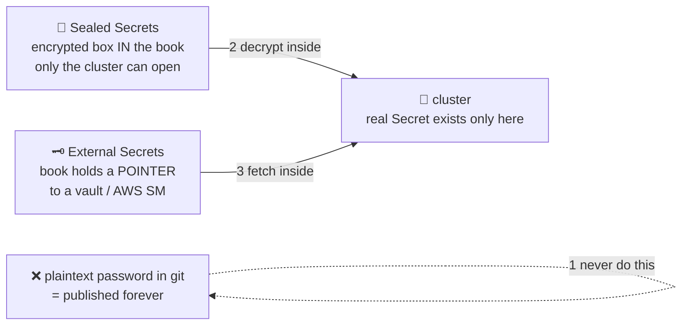

# 🔑 Lesson 12 — Secrets in GitOps + the final scorecard

**📍 You are here:** Lesson **12** of 12 — the final lesson! · Previous: `lesson-11-helm-kustomize-envs`

---

## 📦 What's in this branch

All 12 lessons — the complete course. The last dragon: **secrets** (the one
thing that must never sit plainly in the book), then the final
**with-vs-without-ArgoCD scorecard**.

## 🧒 Explain like I'm 5

The book 📖 is wonderful *because* everyone can read it. Which is exactly why
you must **never glue the locker key inside it**. 🔑❌ A password pasted into
git is a password published — forever (git never forgets, even after you
"delete" it).

Two honest ways to handle keys in a book-world:

1. **A locked box glued into the book** 🔐 (Sealed Secrets): you lock the key
   in a box that **only your school's caretaker** can open, and glue the BOX
   into the book. Everyone can see there's a box; only the robot inside the
   cluster can open it. Safe to publish, still fully GitOps.
2. **A note saying where the key is kept** 🗝️ (External Secrets Operator):
   the book only says *"key #42 from the bank vault"* (AWS Secrets Manager,
   Vault…). A helper inside the school fetches it and hands it to the right
   room. The book stays clean; the vault does vault things (rotation!).

Same rule as the k8s course, lesson 06 — notice board vs locker key —
now applied to the book itself.

## 🗺️ Diagram



## ❓ What

- Our demo app dodged the dragon on purpose (no DB) — but the k8s course's
  `secret.example.yaml` trick (real file git-ignored) does NOT work in
  GitOps: if it's not in the book, the robot doesn't manage it.
- **Sealed Secrets**: a controller with a private key; you encrypt with
  `kubeseal`; the `SealedSecret` goes in git; it becomes a real `Secret`
  only in-cluster. Simple, self-contained.
- **External Secrets Operator (ESO)**: `ExternalSecret` in git references a
  path in a real secret store; ESO syncs it into a `Secret`. Best with
  cloud stores + rotation. (SOPS + age is a third path, same spirit.)

## 🏁 The final scorecard

| | 🎒 by hand | 📮 CI/CD push | 🤖 GitOps pull (ArgoCD) |
|---|---|---|---|
| Repeatable deploys | ❌ your memory | ✅ pipeline | ✅ reconcile loop |
| Drift between deploys | 😱 invisible | ❌ invisible | ✅ detected + reverted in minutes |
| Cluster credentials | 🔑 every laptop | ❌ in CI, outside | ✅ never leave the cluster |
| "What's running right now?" | 🤷 | ⚠️ what CI *sent* | ✅ the book — always true |
| Rollback | repaint from memory | ⚠️ re-run old pipeline | ✅ `git revert`, 10 seconds |
| Audit trail | shell history | ⚠️ CI logs | ✅ `git log` itself |
| 10 clusters | ❌ 10× pain | ❌ 10 keys in CI | ✅ 10 agents, same book |

**The mature setup is BOTH robots:** the courier 📮 still tests and builds
every image (CI never goes away!) — but its last step changes from
`kubectl apply` to **committing the new image tag into the book**. The
caretaker 🤖 does all actual deploying. Courier builds, caretaker deploys —
each doing what it's best at.

## 🧪 Try it (see why git never forgets)

```bash
# prove to yourself that "deleting" a committed secret doesn't work:
echo "password=SuperSecret123" > oops.txt
git add oops.txt && git commit -m "oops" -q
git rm oops.txt -q && git commit -m "remove secret" -q
git show HEAD~1:oops.txt        # 😱 still right there, forever
git reset --hard HEAD~2 -q      # (cleanup — we never pushed, so we got lucky)

# then, for real practice: install sealed-secrets and seal something:
#   https://github.com/bitnami-labs/sealed-secrets#installation
```

## 🎓 You made it — the whole journey

Hand-delivery 🎒 → drift 🪑 → courier robot 📮 → its limits 🚪 → the book 📖
→ the caretaker 🤖 → house rules 📏 → losing a fight with self-heal ↩️ →
10-second rollbacks ⏪ → recipes for many rooms 📚 → locked boxes 🔐.

You now hold the complete deployment story — and with the
[Kubernetes course](https://github.com/BaluRaut/learn-kubernetes-school),
the complete runtime story too. Go build something, and let the robots
carry the homework. 🤖🎒

```bash
git checkout main
```
